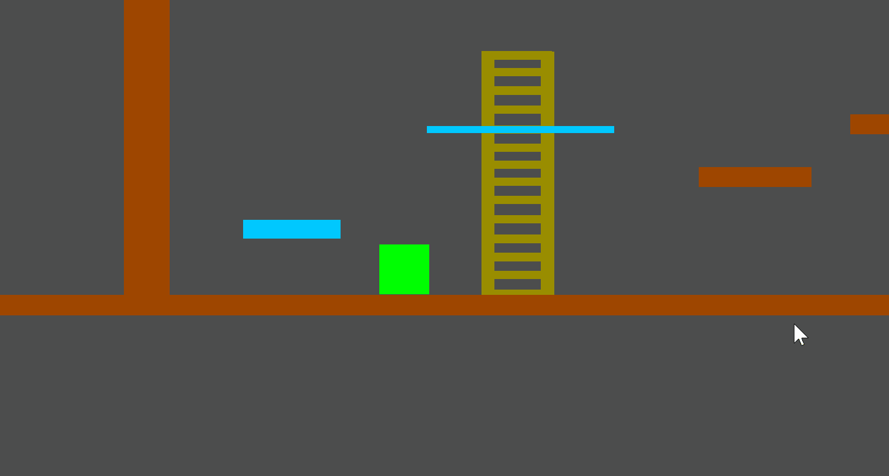

# Template-2dPlatformer
2d平台游戏模板，包含经典的要素

## Unity Version

2019.1.4f1

## 内容

### 角色能力

* 移动（WSAD）
* 多重跳跃（Space）
* 冲刺（Left Control）
* 爬楼梯
  * 按左右键或者跳跃键都会中断爬楼梯
  * 在楼梯附近按up会吸附到楼梯
  * 在单向平台上按down也会吸附到楼梯
* 抓住边缘
  * 按远离墙壁的方向键或跳跃会中断抓住边缘

## 环境元素

* 普通障碍
* 单向平台
* 移动平台
* 楼梯

## 设置说明

* 主角：layer = Entity, tag = Player
* 单向平台：layer = Obstacles, tag = OneWayPlatform

## 参考

<https://github.com/prime31/CharacterController2D>

<https://github.com/ta-david-yu/2D-Platformer-Hunter>